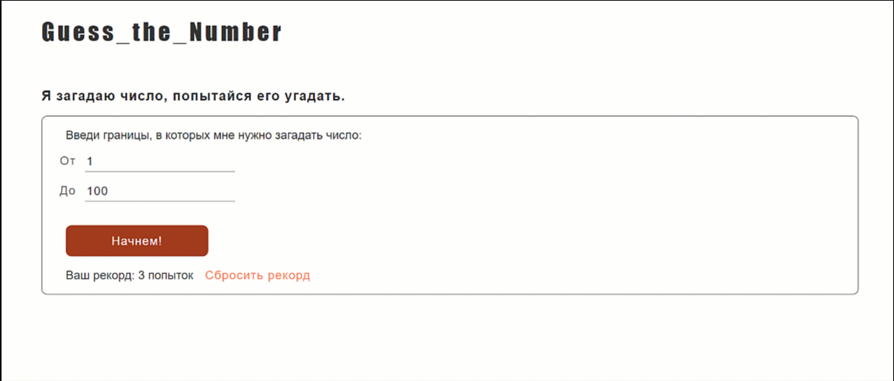

# Wildberries L2

===

### 6. Игра угадай число

#### Решение задачи

Ссылка на игру: https://guess-the-number-mauve-five.vercel.app/

Использованы HTML, CSS, JS.

По умолчанию число загадывается от 1 до 100 (требование задачи).

Пользователь может изменить диапазон чисел.

Каждый ход выводится сообщение о том больше или меньше загаданное число.

Каждые три хода выводится подсказка о четности и нечетности.

Выводится предупреждение, если пользователь введет число за пределами диапазона.

Пользователь не может ввести ничего, кроме чисел.

Работает счетчик попыток.

Работает поле рекорд, его данные хранятся в localStorage.

#### Превью

#### Трудности

Трудностей не возникло.
